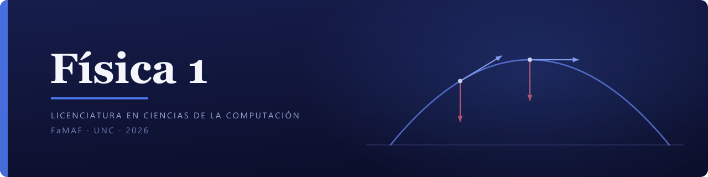

Material de estudio de **Física 1**, cursada 2026. Reúne la bibliografía y los prácticos de la cátedra, los exámenes de años anteriores, y **un apunte teórico propio** que se escribe tema por tema a lo largo de la cursada.

---

## El apunte

Vive en [`sintesis/fisica-1/`](./sintesis/fisica-1). Es **un solo documento LaTeX** (clase `book`) que acumula un capítulo por tema, en el orden lógico de la materia y no en el orden en que se escribieron.

| Cap. | Tema | Guía | Páginas |
|---|---|---|---|
| **1** | Cinemática en una dimensión | 1 | 3–24 |
| **2** | Cinemática en el plano: vectores, tiro parabólico y movimiento circular | 1 | 25–47 |
| **3** | Dinámica I: las tres leyes de Newton | 2 | 48–60 |
| **4** | Dinámica II: rozamiento y sistemas acoplados | 2 | 61–77 |
| **5** | Fuerza elástica y movimiento armónico simple | 2 | 78–95 |
| **6** | Dinámica del movimiento circular | 2 | 96–108 |

Cada capítulo sigue la misma estructura: motivación · marco teórico en bloques, cada uno con su chequeo de comprensión · ejemplos resueltos con andamiaje decreciente · errores comunes · ejercicios en dos niveles.

El capítulo 1 **construye derivada e integral desde cero**, motivadas por la pregunta física, siguiendo el camino del apunte de la cátedra. Es la parte que más rinde: sin eso, la mitad del Práctico 1 no se puede resolver.

Un detalle de procedencia: la composición de resortes que pide el ejercicio 12 no la trata ninguna de las fuentes disponibles. El capítulo 5 la construye desde la ley de Hooke más el principio de superposición, y lo dice en el texto en lugar de atribuírsela a nadie.

### Los resultados de los ejercicios no están en el PDF

Están en los scripts de verificación que acompañan al apunte:

```
sintesis/fisica-1/verificacion-cinematica-1d.py
sintesis/fisica-1/verificacion-cinematica-plano.py
sintesis/fisica-1/verificacion-dinamica-1.py
sintesis/fisica-1/verificacion-dinamica-2.py
sintesis/fisica-1/verificacion-mas.py
sintesis/fisica-1/verificacion-circular-fuerzas.py
```

Corren con `python <archivo>` y solo necesitan `sympy`. Entre los seis suman 906 chequeos. Cada uno resuelve los ejercicios de su capítulo de forma independiente al texto e imprime el razonamiento, no solo el número. Tenerlos separados es deliberado: para ver un resultado hay que ir a buscarlo.

### Compilar

```bash
cd sintesis/fisica-1
pdflatex fisica-1.tex && pdflatex fisica-1.tex   # dos pasadas, por el índice
```

---

## Material de la cátedra

| Carpeta | Contenido |
|---|---|
| [`bibliografia/apunte-catedra/`](./bibliografia/apunte-catedra) | *Introducción a la Física* — Wolfenson, Trincavelli y Serra (FaMAF, 2ª ed. 2021). El texto de los propios docentes. Cubre toda la cinemática y construye el cálculo desde cero |
| [`bibliografia/bibliografia-extra/`](./bibliografia/bibliografia-extra) | Serway & Jewett, *Física para Ciencias e Ingeniería* vol. 2 |
| [`parcial-1/practicos/`](./parcial-1/practicos) | Las cuatro guías de prácticos (0 a 3). La 3 es la versión 2025; la de este año todavía no salió |
| [`examenes-viejos/`](./examenes-viejos) | 17 parciales (2009–2025) y 9 finales (2008–2026) |
| [`plantillas/`](./plantillas) | Plantillas LaTeX propias: `resumen-teorico` (apunte y resoluciones, A4 vertical) y `hoja-ejercicio` (ficha A4 apaisada, un ejercicio por ficha; `ejemplo-hoja-ejercicio.pdf` es la muestra) |
| `Cronograma Tentativo Cursado .pdf` | Cronograma oficial de la cursada |

### Un detalle del cronograma

La columna *"Prácticos: Guía N"* **no indica qué guía corresponde al tema de esa clase**: indica qué guía se resuelve en la sesión de práctico de ese día, que va **una atrás** de la teórica. Por eso la Clase 2 (Cinemática 1D) figura como "Guía 0" cuando en realidad es la Guía 1, y la Clase 7 (Energía I) figura como "Guía 2" cuando es la 3. El mapeo real sale de los prácticos:

| Práctico | Tema |
|---|---|
| 0 | Magnitudes, unidades y vectores |
| 1 | Cinemática 1D y 2D |
| 2 | Dinámica (incluye gravitación y MAS) |
| 3 | Trabajo, energía y colisiones |

---

## Material de repaso

- [`flashcards/fisica-1.tsv`](./flashcards) — 189 tarjetas importables en Anki (tipo de nota "Básica", separador Tab). Etiquetadas por familia — `cinematica-1d`, `cinematica-2d`, `movimiento-circular`, `movimiento-armonico-simple`, `dinamica-newtoniana`, `calculo-diferencial`, `calculo-integral` — además del examen al que pertenecen, de modo que el aparato de cálculo se puede repasar por separado.
- [`mapas-mentales/fisica-1/parcial-i.pdf`](./mapas-mentales/fisica-1) — mapa del Parcial I en un solo panel de 67 × 76 cm, con tres niveles de jerarquía y un color por familia. Se lee en pantalla o se imprime en A1: a esa cantidad de nodos, forzarlo a un A4 bajaría la letra a 2 pt. Refleja los 54 conceptos que había al cerrar el capítulo 4; los capítulos 5 y 6 sumaron 31 más y todavía no se regeneró.

## Carpetas por examen

`parcial-1/`, `parcial-2/` y `final/` comparten convención:

| | |
|---|---|
| `practicos/` | consignas oficiales de la cátedra |
| `soluciones/` | resoluciones propias |
| `preparacion/` | plan de estudio, formulario y material de repaso |

`final/` no tiene `practicos/`: se rinde sobre el material de toda la cursada.

---

## Cómo se escribe el apunte

Con [**syntheca**](https://github.com/PedroMVillar/syntheca), un plugin para Claude Code que orquesta un pipeline de agentes especializados: concilia las fuentes bibliográficas, calibra el nivel contra una ficha de perfil académico, imita el formato de ejercicios de la cátedra, redacta, verifica los resultados por código de forma independiente al texto, y recién entonces pasa por un control de calidad que puede rechazar el borrador y devolverlo a redacción.

La infraestructura de ese pipeline **no está versionada**: quedan fuera `skills/` (fuentes ingeridas, banco de ejercicios y ficha de perfil), `scripts/`, `mapa-estudio.json` y `_inbox/`. Se versiona el producto — el apunte, las flashcards, los mapas mentales y los scripts de verificación.

También quedan fuera los dos PDF de bibliografía que superan los 50 MB (Alonso & Finn, y Serway vol. 1).

---

*Licenciatura en Ciencias de la Computación — FaMAF, Universidad Nacional de Córdoba.*
